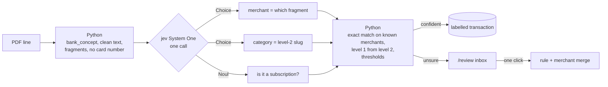

# personal-finance-agent

Local-first personal finance assistant: import bank exports, categorize
transactions with a rules → jev → human cascade, explore dashboards, and chat
with your finances through an LLM agent over a semantic layer.

## Status

Slice 1 (ingestion) is complete. Slice 2 (categorization) is designed and
validated by a spike on real statements; implementation is next. Design:
`docs/superpowers/specs/`. Plans: `docs/superpowers/plans/`.

## How jev categorizes transactions

Bank lines are cryptic (`PAGO CON TARJETA EN SUPERMERCADOS | 1234… SUPER ACME
0042 L`), and a person wants to see "Super Acme, Shopping > Groceries". This project
uses [jev](https://typesafe.ai), TypeSafe AI's System One model, for
the judgement calls. Deterministic Python handles everything else.

jev does not generate text. It answers typed questions about a JSON state:
a [`Choice`](https://docs.typesafe.ai/primitives/choice) returns a probability
for every option, and a [`Noul`](https://docs.typesafe.ai/primitives/noul)
returns the probability of yes. Each transaction becomes one call with three
independent questions:



How the design follows jev's documented patterns:

- **Code proposes, jev chooses.** Python cuts the text into 1–4 word
  fragments and jev picks the brand name
  ([pre-parsed value extraction](https://docs.typesafe.ai/cookbooks/pre_parsed_value_extraction_cookbook)).
  There is no merchant list to maintain: a shop in a new country works on day
  one.
- **One call, many questions.** Merchant, category and subscription are asked
  together and answered independently
  ([parallel questions](https://docs.typesafe.ai/cookbooks/parallel_questions)).
- **Two-level taxonomy from one question.** jev picks the level-2 category;
  level 1 and its confidence come from summing the leaf probabilities, so an
  uncertain "groceries vs. other shopping" still reports "Shopping" with
  confidence
  ([classification using confidence](https://docs.typesafe.ai/cookbooks/classification_using_confidence)).
- **Confidence drives routing.** Per-decision thresholds send only uncertain
  rows to a human, and the same merchant is merged only at ≥ 0.8
  ([confidence](https://docs.typesafe.ai/confidence)).

The spike on 412 real transactions (four rounds, `jev-1.13.0`) cost $0.03 in
total, about 1,800 input tokens per transaction. It unified every branch
and truncation of the same supermarket under one merchant, and 74% of the
transactions got a category confidence of 0.85 or more before any rule
existed. Round-by-round results and lessons are in
[the spike write-up](docs/superpowers/spikes/2026-09-23-jev-categorization/README.md).
Full design: spec sections 4.2 and 5.

## Local setup

Requirements: Docker, [uv](https://docs.astral.sh/uv/), Node 22, [Supabase CLI](https://supabase.com/docs/guides/cli).

```bash
cp .env.example .env            # only SUPABASE_DB_URL is required for slice 1; the other keys are for later features
supabase start                  # local Postgres; copy the DB URL into .env as SUPABASE_DB_URL
supabase db reset               # apply migrations
```

```bash
# terminal 1, from the repo root
cd apps/api && uv sync --group dev && uv run task api
```

```bash
# terminal 2, from the repo root
cd apps/web && npm install && npm run dev
```

Open http://localhost:3000/imports and upload a BBVA or CaixaBank PDF statement,
or run `cd apps/api && uv run finance import ../../data/raw/<statement.pdf>`.

Real statements go in `data/raw/` (git-ignored). Uploading the same file twice
never duplicates a transaction.

## Known limitations

- If a bank changes a settled transaction's description between two exports,
  that transaction appears twice.
- Two movements are treated as the same transaction only when their date,
  amount, description and printed balance all match. With a running balance
  that requires the movements between them to net to zero (for example a
  charge, its reversal, and the same charge again on one day). If two exports
  cut in the middle of such a day each contain a different one of the matching
  movements, the later import skips it.
- A failed import (unsupported file, unreadable PDF, broken balance chain) is
  reported to you but not recorded in the import history. Nothing from the
  file is saved.
- Every upload is recorded in the import history, including re-uploads that
  add no new rows.

## License

MIT, see [LICENSE](LICENSE).
